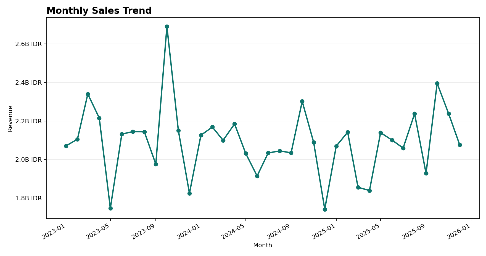
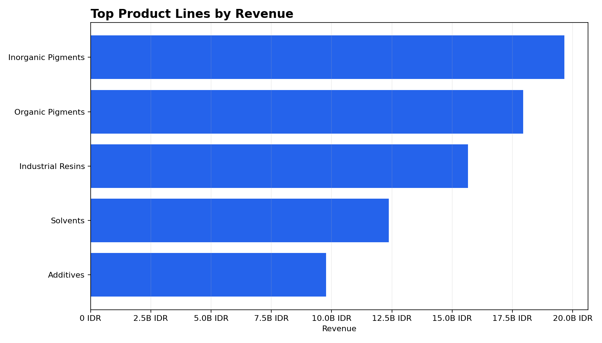
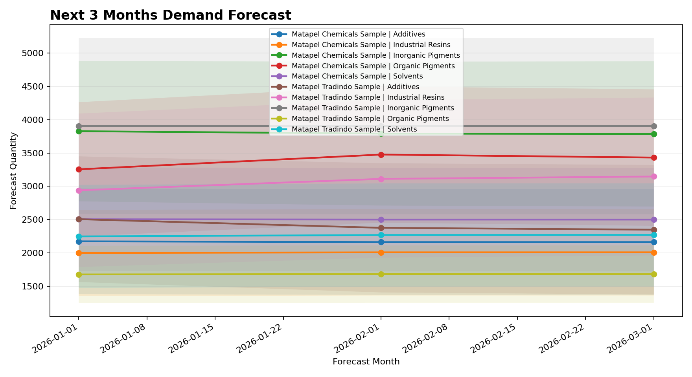
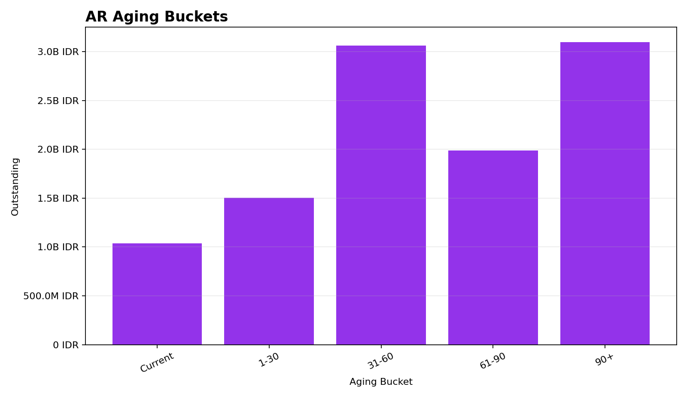
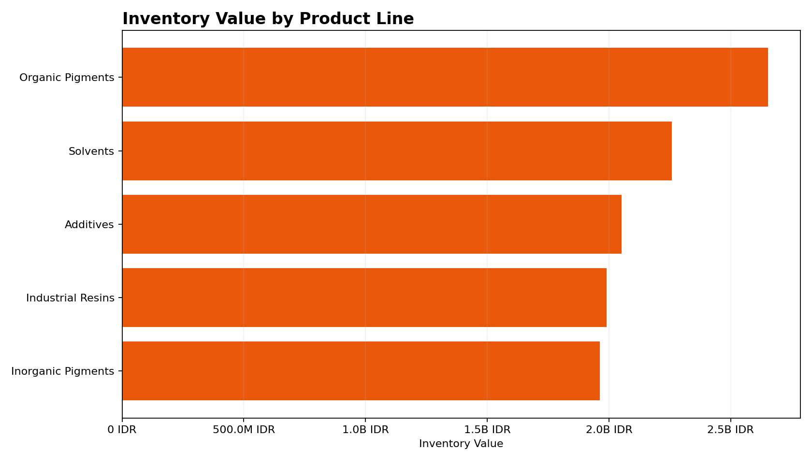

# Matapel Chemicals Operations Analytics: Sales, Demand Forecasting, Inventory, AR/AP, and Working Capital

Python, SQL, and Excel analytics for SAP-style operations exports across the `MPC` and `MPT` company codes.

## Project Overview

This project is a reproducible data analytics case study for chemical distribution operations. It loads SAP-style Excel exports, standardizes field names, validates data quality, builds reporting tables, forecasts chemical product demand, analyzes receivables/payables aging, and exports dashboard-ready files.

The public repository uses synthetic sample data only. The sample files mirror the private export schemas so the full pipeline can be run without access to confidential SAP data.

## Business Questions Answered

- Which product families and product lines drive revenue, volume, and estimated gross profit?
- Which supplier and product categories have repeated late-delivery patterns?
- Which warehouses and product lines show the largest inventory movement/value estimates?
- Which customer and supplier balances create AR/AP and cash-flow risk?
- What chemical product demand should purchasing review for the next three months?

## Confidentiality & Reproducibility

Private SAP exports are excluded from the public repository. Local real-data workbooks belong in `data/raw/`, which is ignored by git. Private run outputs are written only to `outputs/private/`, which is also ignored.

The repository includes synthetic sample workbooks in `data/sample/`. These files use anonymized companies, customers, suppliers, products, and transactions while preserving the same workbook names, sheet names, and columns as the private exports. Public sample outputs are written to `outputs/sample/` and can be committed because they are created only from synthetic data.

## Dataset Description

The pipeline expects six SAP-style Excel exports:

- `RequestData_SalesHist.xlsx` / `Sales`
- `RequestData_PurchHist.xlsx` / `PurchOrder`
- `RequestData_Inventory.xlsx` / `Inventory`
- `RequestData_MasterProduct.xlsx` / `MasterProduct`
- `RequestData_ARAging.xlsx` / `Recv-AgingDet`
- `RequestData_APAging.xlsx` / `Payb-AgingDet`

## Repository Structure

```text
matapel-chemical-operations-analytics/
  data/
    raw/          # ignored; local confidential SAP exports
    sample/       # tracked synthetic Excel exports
  docs/
    images/       # tracked sample-data chart previews
  notebooks/      # sample-data analysis notebooks
  outputs/
    sample/       # tracked sample-data CSV, PNG, and Excel outputs
    private/      # ignored private-data CSV, PNG, and Excel outputs
  reports/
  sql/
  src/
```

## Technical Approach

1. Load all six workbooks using exact sheet names.
2. Standardize columns to `snake_case` and safely rename `Oustanding` to `outstanding`.
3. Parse mixed Excel serial dates, true Excel dates, and date strings.
4. Clean numeric fields and trim customer, supplier, item, category, and product dimensions.
5. Create two product hierarchy fields:
   - `product_family`: broader category from `item_category`, falling back to `item_group`
   - `product_line`: more granular line from `parent_name`, falling back to `product_family`
6. Build monthly sales, purchase, inventory movement/value, AR/AP, forecasting, and working-capital tables.
7. Validate totals, missing values, duplicate keys, invalid dates, negative values, and AR/AP reconciliations.
8. Export local CSV tables, PNG charts, and an Excel workbook.

## Key Capabilities Demonstrated

- Excel ingestion with robust date parsing for SAP-style exports
- Reusable Python cleaning, validation, feature-building, KPI, and forecasting modules
- SQL transformation scripts that mirror the Python logic
- Data-quality reporting for reconciliation and operational exceptions
- Demand forecasting using ARIMA with a trailing-average fallback for sparse history
- Excel dashboard table export with formatted sheets, filters, and frozen headers
- Public sample-data workflow that can be reproduced without private files

## Forecasting Approach

Demand is aggregated monthly by `company` and `product_line`. The pipeline forecasts the next three months after the overall max sales month, so every company/product-line forecast uses the same horizon. Missing historical months are filled with zero before modeling, which keeps intermittent product lines aligned with the full dataset timeline. Product lines with sufficient monthly history use `statsmodels` ARIMA; sparse or unstable series fall back to a trailing three-month average with bounded intervals. The forecast output includes `company` so results stay consistent with the rest of the model.

Sample forecast output:

```text
outputs/sample/tables/forecast_results.csv
outputs/sample/charts/forecast_product_lines.png
```

## Outputs

The sample-data Excel output is safe to commit:

```text
outputs/sample/excel/matapel_dashboard_tables.xlsx
```

The private-data Excel output is ignored by git:

```text
outputs/private/excel/matapel_dashboard_tables.xlsx
```

Workbook sheets:

- `Executive_Summary`
- `Sales_Monthly`
- `Product_Line_Performance`
- `Forecast_Results`
- `Inventory_Summary`
- `AR_Aging`
- `AP_Aging`
- `Working_Capital_KPIs`
- `Data_Quality_Checks`

Sample PNG charts are written to `outputs/sample/charts/`. Private PNG charts are written to `outputs/private/charts/`. When the sample pipeline is run, sample-data chart previews are also copied to `docs/images/` for the README.

## Sample Chart Previews

The charts below are based on synthetic sample data.











## How To Run

Create and activate a virtual environment, then install dependencies:

```bash
python -m venv .venv
source .venv/bin/activate
pip install -r requirements.txt
```

Run the public sample-data workflow:

```bash
python -m src.generate_sample_data
python -m src.export_outputs --sample
```

This writes sample outputs to:

```text
outputs/sample/
```

Run with private local exports:

```bash
python -m src.export_outputs
```

This writes private outputs to:

```text
outputs/private/
```

Private workbooks must be placed in `data/raw/` with the expected file and sheet names. `data/raw/` and `outputs/private/` are intentionally ignored by git, so private outputs cannot overwrite or mix with sample outputs.

## Assumptions And Limitations

- `product_family` is a broader operating category; `product_line` is more granular and may represent a parent product name.
- Estimated COGS uses `quantity * moving_avg_cost` from the sales export.
- Negative sales lines are retained as returns, credit-note, or reversal activity rather than removed during cleaning.
- AR/AP aging files are treated as point-in-time balance snapshots for DSO/DPO estimates.
- AR/AP aging buckets are standardized from `days_overdue`; `Current` contains balances due today or in the future, while `1-30`, `31-60`, `61-90`, and `90+` contain overdue balances.
- AR/AP `document_count` and `counterparty_count` count records with `outstanding > 0`; zero-balance records may remain in record totals and reconciliation checks.
- The inventory file is treated as an inventory movement/value export, not a clean audited month-end inventory snapshot.
- Inventory movement value is estimated as `on_hand_qty * map_cost`.
- DIO is an approximate indicator based on available inventory movement/value records, not an audited inventory-days measure.
- Supplier lead time and delivery delay metrics are calculated only where actual delivery dates are available.
- Forecasts are planning estimates for analysis, not purchasing instructions.
- Data-quality warnings should be reviewed before drawing operational conclusions.

## Project Impact

This project provides a repeatable framework for reviewing sales trends, chemical product demand, supplier delivery performance, inventory movement/value records, AR/AP aging, and working-capital pressure from spreadsheet exports. The sample workflow demonstrates the full structure of the analysis while keeping private operating data out of the public repository.
